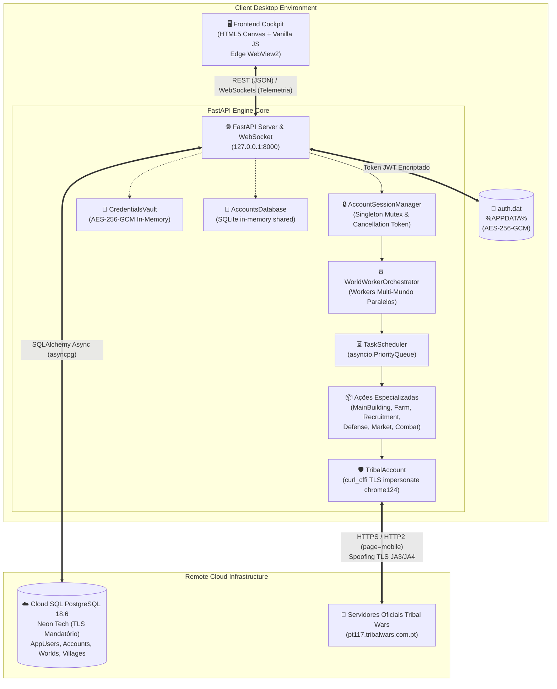

# RELATÓRIO TÉCNICO DE ARQUITETURA & ENGENHARIA DE SOFTWARE
## Sistema Autónomo Distribuído de Automação Client-Side para Aplicações Legadas Web (Tribal Wars Mobile Engine)

**Data de Emissão:** Setembro de 2026  
**Documento:** Memória Descritiva e Especificação de Arquitetura de Software  
**Autor:** Equipa de Engenharia de Software / Straussbikes  
**Estado:** 100% Cloud-Native / Produção Standalone / 332 Testes Automatizados Validados  

---

# 1. VISÃO GERAL & DOMÍNIO DO PROBLEMA

### 1.1 Contexto de Engenharia
A automação de sistemas web legados e de jogos de estratégia em tempo real baseados em navegador (como o *Tribal Wars* / *Tribos*, concebido pela InnoGames GmbH) apresenta desafios singulares de engenharia de software:
1. **Sessão com Estado Estrito (Stateful HTTP):** O backend remoto valida a sequência transacional através de cookies de sessão (`sid`), parâmetros mutáveis de contexto (`village_id`), e tokens de segurança criptográfica anti-CSRF efêmeros (`h` ou `csrf`), os quais são regenerados a cada submissão de formulário ou carregamento de ecrã.
2. **Heurísticas Avançadas de Deteção Anti-Bot:** Os servidores de jogo inspecionam ativamente o tráfego HTTP/HTTPS recebido, avaliando não apenas cabeçalhos estáticos, mas a impressão digital criptográfica da camada de transporte (*TLS Fingerprinting* — JA3/JA4), a cadência temporal dos comandos (deteção estatística de intervalos fixos/robóticos) e padrões de navegação humana através de desafios pontuais (*Bot Protection* / reCAPTCHA / mini-jogos de validação de presença).
3. **Escalabilidade Distribuída Multi-Instância:** Um jogador avançado administra dezenas de aldeias simultaneamente em múltiplos mundos de jogo. Uma abordagem que dependa de múltiplos navegadores abertos esgota rapidamente os recursos físicos da máquina cliente.

### 1.2 Justificação da Abordagem Híbrida / Headless vs. Navegadores Completos
Historicamente, sistemas de automação web recorrem a navegadores headless completos operados via WebDriver ou Chrome DevTools Protocol (CDP), tais como Selenium, Puppeteer, Playwright ou invólucros Electron:
- **Sobrecarga de Recursos (Overhead Computacional):** Cada instância de navegador completo requer entre **150 MB a 400 MB de memória RAM** e gera consumo contínuo de ciclos de CPU para motor de layout (Blink), pipeline de rasterização, compilação JIT de JavaScript secundário e descompressão de assets gráficos desnecessários para a tomada de decisão lógica.
- **Vulnerabilidade a Deteção por CDP:** Navegadores instrumentados via CDP deixam vestígios intrínsecos no runtime (`navigator.webdriver == true`, inconsistências nas permissões da Permissions API, hooks modificados de `window.chrome`).

**A Solução de Engenharia Adotada:**
O presente projeto adota uma arquitetura desacoplada e estritamente híbrida:
1. **Core Engine em Modo Headless Leve:** Utiliza o motor assíncrono em Python baseado na biblioteca `curl_cffi`, operando chamadas HTTP/2 puras com **impersonation criptográfica da biblioteca TLS do Chrome 124**. Consome apenas **~25 MB a 40 MB de memória RAM** e menos de **1% de CPU em repouso**, sem inicializar qualquer thread gráfica.
2. **Interface Gráfica Local Desacoplada (Frontend Cockpit):** A visualização gráfica e interação do utilizador é servida localmente por um Sidecar FastAPI e apresentada através de uma única janela nativa via **Microsoft Edge WebView2** (`pywebview`), aproveitando o runtime Evergreen já pré-instalado no sistema operativo Windows 10/11. Isto elimina a necessidade de distribuir um runtime Electron pesado de 150 MB no instalador da aplicação.

### 1.3 Domínio Operacional: Tribal Wars Mobile Engine
Para maximizar a eficiência de tráfego de rede e simplificar a topologia do DOM a analisar, o motor força deliberadamente a visualização móvel da plataforma através do parâmetro `page=mobile` em todas as rotas do endpoint principal:
$$\text{URI} = \text{https://}\{world\}.\text{tribalwars.com.pt/game.php?village=}\{v\_id\}\&screen=\{screen\}\&page=mobile$$
Benefícios operacionais:
- Redução de até **70% no peso de payloads HTML/CSS** retornados pelos servidores remotos.
- Elementos estruturais essenciais (tabelas de tropas, filas de construção, relatórios de saque) são dispostos em formulários compactos de etapa única ou dupla, diminuindo a complexidade algorítmica do parsing.

---

# 2. STACK TECNOLÓGICA & FERRAMENTAL

| Camada / Função | Tecnologia Adotada | Versão | Justificação Técnica / Papel no Sistema |
|---|---|---|---|
| **Runtime & Core Engine** | Python | 3.11 – 3.14 | Suporte de primeira classe para programação concorrente cooperativa (`asyncio`), `asyncio.PriorityQueue`, `asyncio.Event` e tipagem estática via `typing`. |
| **Camada de Transporte** | `curl_cffi` | 0.16.x | Implementação de `curl` compilada em C com capacidade de mascaramento (*impersonation*) de TLS/JA3/JA4, suporte a HTTP/2 multiplexado e proxies HTTP/SOCKS5 com autenticação. |
| **Parsing & Ingestão** | Regex Compilados & JSON Nativo | Standard Library | Módulos `re` e `json` otimizados para extração determinística em tempo linear $O(n)$ do objeto global JavaScript `game_data` e spans de recursos. |
| **Camada IPC / Backend API** | FastAPI / Uvicorn | 0.110+ / 0.28+ | Arquitetura de micro-framework assíncrono (ASGI) com OpenAPI automática, esquemas Pydantic v2 e canais WebSocket para telemetria em tempo real. |
| **Persistência Cloud-Native** | Cloud SQL (PostgreSQL via Neon Tech) | 18.6 | Base de dados relacional gerida com pool assíncrono (`asyncpg` / SQLAlchemy 2.0 Async) e encriptação em trânsito mandatória (`sslmode=require`). |
| **Persistência Local Efêmera** | SQLite in-memory / Shared Memory | 3.x | URI `file:twbot_memdb?mode=memory&cache=shared` com mutex transacional para armazenamento de templates sem escrita em disco. |
| **Cofre Criptográfico** | `cryptography` (AES-256-GCM) | 42.x+ | Cifra autenticada com chaves de 256 bits e nonces aleatórios de 96 bits para proteção de credenciais de jogo e persistência do ficheiro `auth.dat`. |
| **Desktop Shell GUI** | `pywebview` (Edge WebView2) | 6.2+ | Shell nativo de janela gráfica sem terminal de consola, eliminando a dependência pesada de Chromium empacotado. |
| **Frontend Cockpit** | HTML5 Canvas, Vanilla JS & CSS | ES2022 | Design system responsivo com Dark Glassmorphism, renderização de mapa tático a 60 FPS em Canvas 2D sem frameworks volumosos. |
| **Packaging & Hardening** | PyInstaller & Inno Setup | 6.x / 6.3.3 | Compilação em binário standalone `--noconsole` com supressão de stdout/stderr via `ctypes` e instalador LZMA2 profissional. |
| **Garantia de Qualidade** | Pytest & pytest-asyncio | 8.x / 0.23+ | Suíte de testes unitários e de integração com cobertura exaustiva de modelos, concorrência, combate e evasão de rede. |

---

# 3. TOPOLOGIA DE ARQUITETURA & PADRÕES DE DESIGN

### 3.1 Árvore Física de Diretórios do Repositório

```text
TribalwarsBot/
├── TECHNICAL_ARCHITECTURE_REPORT.md      # [ESTE RELATÓRIO] Documentação técnica formal consolidada
├── PROJECT_STATE.md                      # Memória e progresso contínuo de desenvolvimento
├── GUIA_UTILIZADOR.md                    # Manual operacional do utilizador final
├── GUIA_CLIENTE.md                       # Folha de onboarding comercial de 1 página
├── README.md                             # Visão geral do repositório
├── requirements.txt                      # Dependências Python mínimas de produção
├── pyproject.toml                        # Metadados de empacotamento PEP 518/621
├── TribalWarsBot.spec                    # Diretivas de compilação PyInstaller (noconsole, hooks)
├── file_version_info.txt                 # Metadados de versão do executável Windows PE
├── build_executable.py                   # Script automatizado de pipeline PyInstaller
├── build_installer.py                    # Gerador do setup Inno Setup e pacote ZIP portátil
├── installer.iss                         # Script compilador do Inno Setup 6 (ícone, diretórios)
├── assets/                               # Assets gráficos e ícones compilados
│   ├── icon.ico                          # Ícone oficial Windows multi-camada (16x16 a 256x256)
│   └── icon_original.png                 # Imagem fonte de alta resolução
├── migrations/                           # Esquemas e migrações DDL para PostgreSQL Cloud
│   ├── 001_cloud_sql_init.sql            # Esquema relacional das tabelas de utilizador e jogo
│   └── 002_build_templates.sql           # Modelos de construção com auto-seed inicial
├── scripts/                              # Utilitários administrativos e de manutenção
│   ├── manage_clients.py                 # CLI de administração comercial de licenças
│   ├── sanitize_cloud_db.py              # Purga de dados transacionais com salvaguarda de modelos
│   └── purge_local_state.py              # Script de limpeza de caches legadas do cliente
├── engine/                               # Módulo Core Python (Backend & Orquestração)
│   ├── main.py                           # Ponto de entrada de execução (CLI ou --gui)
│   ├── desktop_launcher.py               # Launcher Edge WebView2 com Bootstrap Gatekeeper
│   ├── config/                           # Definições tipadas e modelos estáticos
│   │   ├── settings.py                   # Dataclasses de configuração (BotConfig, FarmConfig, etc.)
│   │   └── templates.py                  # 5 modelos oficiais de construção imutáveis
│   ├── core/                             # Núcleo de execução assíncrono e concorrência
│   │   ├── account.py                    # TribalAccount: transporte HTTP/2, cookies e CSRF
│   │   ├── scheduler.py                  # TaskScheduler: fila de prioridades e temporização
│   │   ├── models.py                     # Estruturas de dados canónicas (TaskPriority, Resources)
│   │   ├── exceptions.py                 # Hierarquia de exceções de jogo e de rede
│   │   ├── auth_handler.py               # TribalWarsAuthHandler: auto-login e resolução de mundos
│   │   ├── account_session_manager.py    # Singleton de exclusão mútua e troca atómica de contas
│   │   ├── world_worker_orchestrator.py  # Workers multi-mundo paralelos com agendador isolado
│   │   ├── profile_manager.py            # Gestão em memória de perfis de automação
│   │   ├── multi_world_manager.py        # Coordenador de instâncias legadas de mundo
│   │   ├── stats.py                      # Métricas analíticas de recursos e eficiência
│   │   └── world_data.py                 # Ingestão periódica de dados globais de jogadores/aldeias
│   ├── storage/                          # Camada de dados e segurança criptográfica
│   │   ├── cloud_db.py                   # ORM PostgreSQL, repositórios, licenças e cofre AES-256
│   │   ├── database.py                   # SQLite transacional in-memory para templates
│   │   └── token_storage.py              # TokenStorage: gestão encriptada de 'auth.dat'
│   ├── actions/                          # Sub-módulos de ações de jogo (ecrãs do game.php)
│   │   ├── main_building.py              # Edifício Principal: filas e grafos de dependência
│   │   ├── recruitment.py                # Recrutamento militar em lotes equilibrados
│   │   ├── farm.py                       # Assistente de Farm A/B e varredura de raio
│   │   ├── place.py                      # Praça de Reunião: comandos de ataque/apoio
│   │   ├── map.py                        # Varredura tática de mapa euclidiano
│   │   ├── market.py                     # Mercado e balanceamento dinâmico de recursos
│   │   ├── defense.py                    # Monitorização de incomings e desvio de tropas (dodge)
│   │   ├── combat_tactics.py             # Comboios de nobres e ataques coordenados
│   │   ├── combat_sync.py                # Sincronização de relógio e janelas de milissegundo
│   │   ├── scavenge.py                   # Coleta de recursos em 4 níveis (Scavenging)
│   │   ├── snob.py                       # Academia: cunhagem de moedas e nobres
│   │   ├── smith.py                      # Ferreiro: pesquisas tecnológicas
│   │   ├── quest.py                      # Conclusão automática de missões e bónus diário
│   │   ├── inventory.py                  # Consulta ao inventário de itens da conta
│   │   ├── economic_arbitrage.py         # Arbitragem económica e fila de emergência
│   │   └── village_coordinator.py        # Coordenador multi-aldeia (Ataque/Defesa)
│   ├── api/                              # Camada REST / WebSocket Sidecar IPC
│   │   ├── server.py                     # Instanciação FastAPI e montagem estática
│   │   ├── routes.py                     # Definição de endpoints REST protegidos por token
│   │   ├── context.py                    # EngineContext: orquestrador de estado partilhado
│   │   ├── client.py                     # Cliente HTTP assíncrono para testes
│   │   └── auth.py                       # Autenticação de tokens de handshake sidecar
│   └── utils/                            # Utilitários transversais
│       ├── crypto.py                     # Funções criptográficas auxiliares
│       ├── parsers.py                    # Parsers regex/HTML resilientes (3000+ linhas)
│       ├── timing.py                     # Distribuição gaussiana truncada e micro-jitters
│       ├── paths.py                      # Resolução de caminhos para modo congelado PyInstaller
│       ├── runtime.py                    # Sanitização de stdout/stderr para executável GUI
│       └── logging_setup.py              # RotatingFileHandler silencioso em %APPDATA%
├── frontend/                             # Interface Gráfica de Utilizador (Cockpit)
│   ├── index.html                        # SPA modular: Portal de Login, Hub e Abas de Controlo
│   ├── css/style.css                     # Sistema visual Dark Glassmorphism, animações CSS
│   └── js/                               # Controladores de interface client-side
│       ├── app.js                        # Controlador principal da UI, dashboards e eventos
│       ├── api.js                        # Abstração de chamadas REST assíncronas ao Sidecar
│       ├── websocket.js                  # SidecarWebSocket: telemetria e reconexão automática
│       └── map_viewer.js                 # Motor de renderização de mapa em HTML5 Canvas
└── tests/                                # Suite de 332 Testes Automatizados Unitários/Integração
    ├── test_farm.py                      # Testes da automação de farm e prioridades
    ├── test_auto_login.py                # Testes de cofre de senhas e autenticação web
    ├── test_commercial_licensing.py      # Testes de expiração de licenças e restrições
    ├── test_world_worker_orchestrator.py # Testes de paralelismo e concorrência multi-mundo
    └── ... (40 ficheiros de teste)
```

---

### 3.2 Padrões de Design de Software Identificados

1. **Sidecar Pattern (IPC Local):**
   A camada de automação (`engine`) é desacoplada da camada de apresentação (`frontend`). O backend executa como um servidor HTTP/WebSocket local (`127.0.0.1:8000`), comunicando com a interface através de chamadas REST e eventos WebSocket em tempo real. O frontend não possui lógica de persistência direta nem gere sockets HTTP de jogo.
2. **Producer-Consumer via `asyncio.PriorityQueue`:**
   O módulo `TaskScheduler` atua como um coordenador assíncrono central. As rotinas de decisão (ex.: Auto-Build, Auto-Farm, Dodge) produzem tarefas instanciadas (`Task`), inserindo-as na fila de prioridades. O loop worker consome a tarefa mais prioritária cujo tempo de execução (`scheduled_at`) já tenha sido atingido, garantindo preempção determinística.
3. **Singleton & State Lock Monousuário (`AccountSessionManager`):**
   Para evitar múltiplos acessos concorrentes acidentais com a mesma conta de jogo (o que provocaria ban imediato por duplicidade de sessão nos servidores de jogo), o `AccountSessionManager` foi concebido como um Singleton thread-safe com exclusão mútua (`asyncio.Lock`). Apenas um utilizador de jogo (`game_username`) detém o lock ativo. Ao comutar de conta, o sistema emite um sinal cooperativo através de um `cancellation_token` (`asyncio.Event`), aguarda a finalização limpa dos workers e só então liberta o estado para a nova conta.
4. **Repository Pattern (Camada de Dados Cloud SQL):**
   A persistência em PostgreSQL é totalmente abstraída através de repositórios assíncronos desacoplados (`AppUserRepository`, `GameAccountRepository`, `GameWorldRepository`, `VillageRepository`, `BuildTemplateRepository`). O código de negócio não executa SQL manual, operando apenas através de métodos tipados.
5. **Data Transfer Objects (DTO) com Pydantic v2 & Dataclasses:**
   Validação estrita de contratos de entrada e saída nos limites do sistema (endpoints HTTP e modelos de configuração em `engine/config/settings.py`).

---

### 3.3 Diagrama de Fluxo de Dados e Topologia do Sistema



---

# 4. SUBSISTEMAS & MÓDULOS IMPLEMENTADOS (DETALHE TÉCNICO)

### 4.1 Autenticação e Gestão de Sessão
- **Classes Principais:** `TribalWarsAuthHandler` (`engine/core/auth_handler.py`), `TribalAccount` (`engine/core/account.py`), `CredentialsVault` (`engine/storage/cloud_db.py`).
- **Mecânica de Autenticação Web:**
  O `TribalWarsAuthHandler` executa uma chamada HTTP POST simulando o formulário desktop oficial em `https://www.{domain}/index.php?action=login`, fornecendo `user`, `password` e `remember=1`. A resposta é inspecionada para validação de cookies de sessão (`sid`). Caso a conta tenha múltiplos mundos disponíveis, analisa a lista de seleção de mundos e executa um redirecionamento interno para `https://www.{domain}/game.php?screen=overview&page=mobile`.
- **Proteção Criptográfica de Credenciais:** As palavras-passe do jogo e os tokens `sid` são encriptados com cifra simétrica AES-256-GCM com nonce de 96 bits antes de serem gravados na tabela `game_accounts` do Cloud SQL.
- **Renovação de CSRF e Sessão:** O motor inspeciona o objeto JavaScript `game_data.csrf` e tokens de formulário ocultos `<input type="hidden" name="h" ...>` em todas as respostas HTML recebidas. O token é atualizado em tempo real na propriedade `account.csrf_token`. Se uma chamada retornar indício de sessão expirada (`SESSION_EXPIRED_PATTERNS`), uma exceção `SessionExpiredError` é lançada, acionando a rotina de re-login automático sem intervenção do utilizador.
- **Rotina Keep-Alive:** Uma tarefa periódica de baixa prioridade (`TaskPriority.BACKGROUND`) executa requisições de consulta suave ao ecrã `screen=overview` com jitter estocástico para prevenir o encerramento da sessão por inatividade do servidor.

---

### 4.2 Motor de Agendamento Assíncrono (`TaskScheduler`)
- **Fila de Prioridades Preemptiva:**
  Implementada sobre `asyncio.PriorityQueue[Task]`, onde a ordenação obedece estritamente ao valor numérico do enum `TaskPriority`:

$$\text{Prioridade Numérica: } \text{ALERT (0)} < \text{DEFENSE (10)} < \text{FARM (20)} < \text{SCAVENGE (30)} < \text{BUILD (40)} < \text{RECRUIT (50)} < \text{QUEST (60)} < \text{REFRESH (90)} < \text{IDLE (100)}$$

- **Temporização e Dispersão Humana:** Cada tarefa possui um timestamp de execução agendada (`scheduled_at`). O laço de despacho (*worker loop*) consulta o topo da fila via método `queue.get()`. Se o tempo atual for inferior a `scheduled_at`, o worker liberta temporariamente a thread através de `await asyncio.sleep(diff)` ou acorda imediatamente caso um evento de emergência (`_wake_event`) seja assinalado (ex.: alarme de ataque recebido).
- **Auto-Pausa Reativa de Segurança:**
  Ao intercetar um erro do tipo `BotProtectionError`, o `TaskScheduler` invoca instantaneamente `self.pause()`, interrompendo o consumo de tarefas e disparando os callbacks assíncronos registados (`_bot_protect_handlers`), que por sua vez emitem alertas WebSocket para o frontend solicitando resolução manual do utilizador.
- **Tratamento de Rate Limits (HTTP 429):**
  Ao receber um código HTTP 429 ou exceção `RateLimitError`, o worker isola apenas o mundo afetado, calcula um tempo de congelamento seguro (`rate_limit_until = time.time() + retry_after`) e reagenda as tarefas afetadas com backoff exponencial:
$$T_{backoff} = T_{base} \times 2^{attempt} + \text{jitter}$$

---

### 4.3 Evasão Estatística & Modelagem Comportamental (`timing.py`)
Para evitar assinaturas estáticas de automação detetáveis por testes estatísticos (ex.: testes de Kolmogorov-Smirnov sobre a distribuição de intervalos entre requisições), todos os atrasos aplicados aos fluxos de cliques e ações utilizam **Distribuições Gaussianas Truncadas com Micro-Jitters**.

1. **Atraso Humano de Ação (`get_human_delay`):**
   Calculado através do algoritmo de amostragem por rejeição (*rejection sampling*) sobre uma normal $X \sim \mathcal{N}(\mu, \sigma^2)$, delimitado estritamente no intervalo $[min, max]$:

$$f(x; \mu, \sigma) = \frac{1}{\sigma \sqrt{2\pi}} \exp\left( -\frac{1}{2}\left(\frac{x - \mu}{\sigma}\right)^2 \right), \quad x \in [min, max]$$

Ao valor obtido adiciona-se uma micro-flutuação estocástica contínua $J \sim \mathcal{U}(-0.02, 0.02)$ representando variações de latência de rede e processamento mecânico.
2. **Tempo de Reação Neuromotor de Clique (`get_click_jitter`):**
   Simula o tempo de toque em ecrãs móveis entre interações sucessivas. Configurado com média $\mu = \frac{min + max}{2}$ e desvio padrão $\sigma = \frac{max - min}{6}$ (garantindo que 99,73% das amostras caem empiricamente dentro da janela natural de 120 ms a 380 ms).

---

### 4.4 Edifício Principal (`MainBuildingManager`)
- **Grafo de Dependências Tecnológicas (`BUILDING_REQUIREMENTS`):**
  O módulo modela a árvore de pré-requisitos de edifícios como um Grafo Acíclico Dirigido (DAG). Antes de submeter a evolução de qualquer edifício (ex.: Academia / `snob`), o método `get_missing_prerequisites` inspeciona os níveis atuais da aldeia e gera automaticamente a sequência de tarefas prévias necessárias:
  $$\text{Academia (snob)} \implies \text{Edifício Principal Nv. 20} \land \text{Ferreiro Nv. 20} \land \text{Mercado Nv. 10}$$
- **Controlo de Custos Exponenciais:**
  O custo de recursos e população de cada nível é modelado pela equação exponencial canónica do jogo:
  $$\text{Custo}(nivel) = \text{CustoBase} \times \text{Fator}^{(nivel - 1)}$$
- **Gestão da Fila de Construção (`#buildqueue`):**
  Lê os elementos ativos na fila através de `parse_build_queue`. Garante estritamente o limite `max_queue = 2`, prevenindo que o bot incorra na taxa de penalização de 25% de recursos adicionais que o jogo cobra a partir da 3ª ordem em fila sem Conta Premium ativa.
- **Finalização Imediata Gratuita (*Instant Finish*):**
  Se o tempo de conclusão de uma construção for inferior a 3 minutos ($\le 180\text{ segundos}$), o motor deteta e submete imediatamente a ação de finalização gratuita instantânea, libertando a fila para o próximo passo.

---

### 4.5 Gestão Militar & Recrutamento (`RecruitmentManager`, `SmithManager`)
- **Produção Militar Contínua em Micro-Lotes:**
  Evita congelar milhares de recursos numa única encomenda no Quartel (`barracks`), Estábulo (`stable`) ou Oficina (`garage`). O recrutamento opera em lotes pequenos configuráveis (`batch_sizes`, ex.: 5 a 10 unidades por iteração).
- **Validação de Capacidade da Fazenda:**
  $$\text{População Livre Necessária} = \text{min\_free\_pop} + \sum_{u} (N_u \times \text{UNIT\_POP\_COST}[u])$$
  O recrutamento é suspenso automaticamente se a população livre for insuficiente, priorizando a expansão da Fazenda antes de gerar novas unidades.
- **Pesquisa Tecnológica no Ferreiro (`SmithManager`):**
  Inspeciona a árvore de pesquisas ativas e pendentes através de `parse_smith_research`, despachando automaticamente as pesquisas requeridas para desbloquear tropas (ex.: Cavalaria Leve requer Ferreiro Nv. 5).

---

### 4.6 Praça de Reunião & Assistente de Farm (`FarmManager`, `PlaceManager`)
- **Protocolo Transacional em 2 Etapas:**
  O Tribal Wars exige que o envio de ataques ou apoios seja submetido em duas etapas consecutivas:
  1. *Etapa 1 (Validação):* POST para `screen=place&try=confirm` com tropas e coordenadas alvo. O servidor devolve a página de confirmação contendo inputs ocultos de verificação (`ch`, identificador de ação, coordenadas de destino e custo de tempo).
  2. *Etapa 2 (Despacho):* Extração dos hashes e submissão via POST para `screen=place&action=command` confirmando o comando militar.
- **Micro-Farming e Assistente de Saque (Modelos A / B):**
  O `FarmManager` executa a automação de saques em massa utilizando tanto o Assistente de Saque (`screen=am_farm`) como a Praça de Reunião (`screen=place`).
- **Algoritmo de Priorização Inteligente de Alvos:**
  A cada ciclo de varredura (executado periodicamente a cada 45 a 90 segundos), todas as aldeias bárbaras mapeadas no raio euclidiano $R \le \text{max\_distance}$ são avaliadas e ordenadas pela função de pontuação:
  1. **Alvos com Recursos Cheios** (`loot_status == 'full'`): Prioridade 100.
  2. **Alvos com Recursos Parciais** (`loot_status == 'partial'`): Prioridade 80.
  3. **Novas Aldeias Bárbaras não Registadas** (`not is_in_am_farm` ou `report_color == 'none'`): Prioridade 70 (envio de ataque inicial de *bootstrap* via Praça para forçar a integração no Assistente de Saque).
  4. **Alvos com Estado Desconhecido** (`loot_status == 'unknown'`): Prioridade 50.
  5. **Alvos com Recursos Esgotados** (`loot_status == 'empty'`): Sujeitos a um cooldown estrito de regeneração de 10 minutos (600 segundos); prioridade reduzida para 30 (pós-cooldown) ou 10 (em cooldown ativo).
  6. **Critério de Desempate:** Distância euclidiana ascendente à aldeia de origem.
- **Prevenção Estrita de Ataques Concorrentes:**
  O sistema verifica se o alvo já possui tropas a caminho (`has_attack_in_transit`) ou se foi atacado na janela recente de segurança (`_recent_farm_targets`), evitando desperdício de tropas sobre o mesmo alvo.
- **Early-Exit por Esgotamento de Tropas:**
  Se o motor detetar consecutivamente 4 tentativas sem tropas disponíveis na aldeia, interrompe imediatamente o ciclo corrente, prevenindo requisições redundantes até que os saques em trânsito regressem.
- **Telemetria WebSocket:** Emite o evento `FARM_CYCLE_DONE` contendo os totais de saques disparados e novas bárbaras integradas.

---

### 4.7 Defesa e Salvaguarda Operacional (`DefenseManager`, `combat_sync.py`)
- **Monitorização Contínua de Incomings:**
  Verifica a presença de ataques a chegar através do cabeçalho global `#incomings_amount`. Caso detetado, executa requisição ao ecrã `screen=overview` e extrai os metadados de cada comando (tempo de impacto, origem, destino, ID do comando).
- **Alarme Sonoro & Broadcast WebSocket:**
  Dispara instantaneamente o evento `captcha` ou `INCOMING_ATTACK` via WebSocket para despertar a interface do utilizador.
- **Algoritmo de Esquiva Automática (*Auto-Dodge*):**
  Para preservar o exército de ataques de limpeza (*cleans*) inimigos sem perdas materiais:
  1. Calcula o momento de impacto do ataque hostil mais iminente ($T_{impact}$).
  2. Agenda o envio de todas as tropas defensivas/ofensivas da aldeia num comando de apoio a uma aldeia bárbara neutra com antecedência de segurança:
     $$T_{envio} = T_{impact} - \text{dodge\_lead\_time\_seconds} \quad (\text{ex.: } 30\text{ segundos antes})$$
  3. Agenda o cancelamento do comando militar logo após a confirmação do impacto do ataque inimigo:
     $$T_{cancel} = T_{impact} + \text{dodge\_cancel\_delay\_seconds} \quad (\text{ex.: } 5\text{ segundos após})$$
  4. Como o cancelamento ocorre dentro da janela permitida de 10 minutos da Praça de Reunião, as tropas voltam com segurança para a aldeia de origem sem sofrer dano.
- **Sincronização de Relógio de Alta Precisão (`ClockSynchronizer`):**
  Calcula o desfasamento entre o relógio local do sistema e o relógio do servidor do jogo através de amostragem estatística de cabeçalhos HTTP `Date`:
  $$\Delta t = T_{server} - T_{local} - \frac{\text{RTT}}{2}$$
  Permite agendamento de ataques e cancelamentos com tolerância inferior a 100 milissegundos.

---

### 4.8 Mercado & Coordenador Multi-Aldeia (`MultiVillageCoordinator`, `MarketManager`)
- **Especialização Tática de Aldeias:** Cada aldeia sob gestão da conta é classificada como **Ataque** (`attack`) ou **Defesa** (`defense`).
- **Balanceamento Automático de Recursos:**
  O `MarketManager` analisa a capacidade do armazém de todas as aldeias da conta. Se uma aldeia atinge $\ge 90\%$ de ocupação de um determinado recurso enquanto outra aldeia da conta opera em défice crítico ($\le 30\%$), calcula a quantidade ideal a transferir (respeitando a margem de segurança de 20% e a capacidade dos mercadores disponíveis, onde 1 mercador transporta 1000 unidades) e despacha a caravana comercial autonomamente.

---

# 5. CONTRATOS DE DADOS, INTERFACES E SCHEMAS

### 5.1 Modelos Pydantic Principais (`engine/api/routes.py`)

```python
class AppUserLoginRequest(BaseModel):
    email: str
    password: str

class GameAccountCreateRequest(BaseModel):
    game_username: str
    sid: Optional[str] = ""
    domain: Optional[str] = "tribalwars.com.pt"
    proxy: Optional[str] = None
    password: Optional[str] = None

class GameWorldCreateRequest(BaseModel):
    world_code: str
    is_active: Optional[bool] = True

class FarmConfigRequest(BaseModel):
    world: Optional[str] = None
    enabled: Optional[bool] = None
    default_template: Optional[str] = None
    max_distance: Optional[float] = None
    scan_all_radius_barbarians: Optional[bool] = None
    bootstrap_unlisted_barbarians: Optional[bool] = None
    min_interval_seconds: Optional[float] = None
    max_interval_seconds: Optional[float] = None
    min_delay_per_attack_ms: Optional[int] = None
    max_delay_per_attack_ms: Optional[int] = None
    avoid_concurrent_attacks: Optional[bool] = None
    stop_on_losses: Optional[bool] = None
    custom_targets: Optional[List[Any]] = None

class ActionResponse(BaseModel):
    status: str
    message: Optional[str] = None
    task_id: Optional[str] = None
    barbarians_count: Optional[int] = None
```

---

### 5.2 Matriz Consolidada de Endpoints REST

| Método | URI | Autenticação | Payload / Query | Schema de Resposta | Descrição Operacional |
|---|---|---|---|---|---|
| `GET` | `/api/health` | Token | N/A | `{"status": "ok", "uptime": float}` | Verificação de liveness do sidecar. |
| `GET` | `/api/status` | Token | N/A | Estado consolidado JSON | Retorna dados da conta, aldeia atual, scheduler e módulos. |
| `POST` | `/api/auth/app-user/register` | Aberto | `AppUserRegisterRequest` | `{"status": "success", "token": str, ...}` | Registo de utilizador da aplicação no Cloud SQL. |
| `POST` | `/api/auth/app-user/login` | Aberto | `AppUserLoginRequest` | `{"status": "success", "token": str, ...}` | Login de utilizador, validação de licença e emissão de JWT. |
| `GET` | `/api/accounts/list` | Token | N/A | `{"status": "success", "accounts": [...]}` | Lista contas de jogo registadas pelo utilizador. |
| `POST` | `/api/accounts/create` | Token | `GameAccountCreateRequest` | `{"status": "success", "account": {...}}` | Cria nova conta de jogo com cofre AES-256 no Cloud SQL. |
| `POST` | `/api/accounts/switch` | Token | `GameAccountSwitchRequest` | `{"status": "success", "active_account": str}` | Comutação atómica com cancelamento cooperativo. |
| `GET` | `/api/worlds/list` | Token | `account_id: Optional[str]` | `{"status": "success", "worlds": [...]}` | Lista mundos associados à conta ativa. |
| `POST` | `/api/worlds/create` | Token | `GameWorldCreateRequest` | `{"status": "success", "world": {...}}` | Regista novo mundo de jogo. |
| `POST` | `/api/worlds/toggle/{w_id}` | Token | `GameWorldToggleRequest` | `{"status": "success", "is_active": bool}` | Ativa ou desativa a execução do worker de um mundo. |
| `GET` | `/api/farm/status` | Token | `world: Optional[str]` | `FarmStatusResponse` | Retorna configurações de farm e estado do scheduler. |
| `POST` | `/api/farm/toggle` | Token | `FarmToggleRequest` | `ActionResponse` | Liga/desliga a automação contínua de farm. |
| `POST` | `/api/farm/config` | Token | `FarmConfigRequest` | `ActionResponse` | Atualiza parâmetros de raio, intervalos e templates. |
| `GET` | `/api/farm/targets` | Token | `world: Optional[str]` | `{"status": "success", "targets": [...]}` | Retorna lista de aldeias bárbaras mapeadas no raio. |
| `GET` | `/api/building/templates`| Token | N/A | `{"status": "success", "templates": [...]}` | Lista os 5 modelos padrão oficiais e modelos do utilizador. |
| `POST` | `/api/villages/{v_id}/model`| Token | `VillageUpdateModelRequest` | `{"status": "success", "village": {...}}` | Associa um modelo de construção a uma aldeia específica. |

---

### 5.3 Eventos e Mensagens WebSocket (Backend $\to$ Frontend)

| Tipo de Mensagem | Payload Chave | Descrição Técnica do Gatilho |
|---|---|---|
| `INITIAL_STATE` | `status_dict` | Emitido no handshake inicial ao estabelecer a conexão WebSocket. |
| `status` | `{"connected": bool}` | Notifica alteração do estado de conexão da telemetria. |
| `log` | `{"level": str, "logger": str, "message": str}` | Encaminhamento em tempo real de logs operacionais para a consola da UI. |
| `VILLAGE_UPDATED` | `village_data` | Emitido quando recursos, edifícios ou tropas da aldeia são atualizados. |
| `captcha` | `{"detected_at": float, "url": str}` | Alerta crítico de desafio anti-bot detetado; bloqueia a UI e emite som de alerta. |
| `FARM_CYCLE_DONE` | `{"total_attacks": int, "am_farm": int, "bootstrap": int}` | Emitido no final de cada ronda periódica de saque automatizado. |
| `MARKET_RESOURCES_SENT` | `{"wood": int, "stone": int, "iron": int}` | Emitido aquando do envio bem-sucedido de uma caravana de balanceamento. |
| `ALL_VILLAGES_CYCLE_DONE`| `{"building_actions": int, "recruitment_actions": int}` | Notificação de conclusão de ronda global multi-aldeia. |

---

# 6. QUALIDADE, COBERTURA DE TESTES & RESILIÊNCIA

### 6.1 Inventário de Testes Automatizados
O repositório possui uma infraestrutura de testes completa em `tests/`, totalizando **332 testes unitários e de integração funcionais**, todos aprovados com 100% de sucesso sob Python 3.14:

```text
====================== 332 passed, 21 warnings in 43.34s ======================
```

#### Distribuição dos 40 Ficheiros de Teste:
1. `test_farm.py` (17 testes): Testes do algoritmo de priorização de bárbaras (recursos cheios/parciais, novos bootstraps, cooldown de vazias), early-exit por falta de tropas e broadcast.
2. `test_auto_login.py`: Fluxos de login web real, parsing de cookies, cofre criptográfico AES-256 e prevenção de loops de CAPTCHA.
3. `test_commercial_licensing.py`: Verificação de datas de expiração de licença (`expires_at`), estados de suspensão (`is_active=False`) e imposição do limite `max_accounts`.
4. `test_world_worker_orchestrator.py`: Execução paralela de múltiplos mundos, isolamento de rate limits HTTP 429 e cancelamento gracioso.
5. `test_account_session_manager.py`: Testes de exclusão mútua monousuário, locking concorrente e integridade na comutação atómica.
6. `test_cloud_sql_models.py`: Validação de esquemas relacionais, migrações DDL e integridade de chaves estrangeiras.
7. `test_main_building.py`: Resolução de árvores de dependência (DAG), filas de construção e verificação de custos de recursos.
8. `test_recruitment.py`: Lotes equilibrados de tropas e validação de população da Fazenda.
9. `test_defense.py`: Incomings, temporização e integridade do algoritmo de *Auto-Dodge*.
10. `test_combat.py` & `test_smith.py`: Comboios de nobres, sincronização milissegundo e pesquisas no ferreiro.
11. `test_market.py` & `test_arbitrage.py`: Algoritmo de balanceamento de recursos e fila de emergência.
12. `test_map.py` & `test_world_data.py`: Cálculo euclidiano de distâncias e radar de inativos.
13. `test_api.py`, `test_api_auth_and_hierarchy.py`, `test_api_farm.py`: Cobertura completa de rotas REST e autorização por tokens.
14. `test_packaging_utils.py`: Validação de `resource_path()`, `SafeStreamWriter` e logging rotativo silencioso em `%APPDATA%`.

### 6.2 Estratégias de Validação & Resiliência a Falhas de Rede
- **Isolamento Total de Efeitos Secundários:** A suite de testes recorre a mocks assíncronos (`AsyncMock`, `unittest.mock`) para simular respostas HTTP dos servidores de jogo, garantindo execução determinística e sem dependência de conectividade externa.
- **Injeção de Falhas de Rede:** Cenários de teste simulam ativamente quebras de conexão (`NetworkTimeoutError`), manutenções de servidor (`GameMaintenanceError`), expiração forçada de sessão (`SessionExpiredError`) e respostas HTTP 429 / 502, validando que os agendadores aplicam recuo exponencial e recuperação transparente sem quebras de execução (*crashes*).

---

# 7. ESTADO ATUAL vs. ROADMAP TÉCNICO (GAP ANALYSIS)

### 7.1 Funcionalidades 100% Funcionais e Validadas ([x])
- [x] **Core Assíncrono com Evasão TLS:** Implementação de `curl_cffi` com spoofing de Chrome 124 Android (JA3/JA4) e cabeçalhos consistentes.
- [x] **Camada Cloud SQL PostgreSQL 18.6:** Hierarquia relacional `AppUser` $\to$ `GameAccount` $\to$ `GameWorld` $\to$ `Village` via Neon Tech com SSL mandatário.
- [x] **Cofre Criptográfico AES-256-GCM:** Encriptação simétrica de palavras-passe, tokens `sid` e persistência do ficheiro `auth.dat` via `TokenStorage`.
- [x] **Eliminação de Persistência Local (Zero I/O no Cliente):** Fim de ficheiros `.db` locais; `AccountsDatabase` opera exclusivamente em memória partilhada SQLite.
- [x] **5 Modelos Padrão Oficiais de Construção Imutáveis:** Sincronizados na cloud e no motor local (incluindo o modelo `Construcao` com sequência completa de 256 passos).
- [x] **Auto-Login & Restauro Transparente:** Autenticação web real, seleção de mundos e deteção anti-loop de CAPTCHA.
- [x] **Exclusão Mútua Monousuário (`AccountSessionManager`):** Mutex thread-safe que impede a execução concorrente de múltiplas contas de jogo em simultâneo.
- [x] **Orquestração Multi-Mundo Concorrente (`WorldWorkerOrchestrator`):** Execução paralela de todos os mundos ativos sob a conta selecionada, com agendadores isolados e confinamento de HTTP 429.
- [x] **Assistente de Farm Totalmente Automatizado:** Varredura cíclica periódica (45 a 90 segundos) com priorização de alvos por estado de recursos (100: cheios, 80: parciais, 70: novas bárbaras, 30/10: vazias), early-exit por falta de tropas, remoção do botão manual na UI e preservação de alertas e telemetria WebSocket.
- [x] **Edifício Principal, Recrutamento e Mercado:** Auto-build por modelos, recrutamento contínuo em lotes, balanceamento de recursos entre aldeias e esquiva automática de ataques (*Auto-Dodge*).
- [x] **Pipeline de Build Standalone Comercial:** Executável compilado via PyInstaller em modo puro GUI (`--noconsole`), supressão de stdout/stderr via `SafeStreamWriter`, logs em `%APPDATA%` e gerador de instalador profissional Inno Setup 6 com ícone oficial.
- [x] **Gestão Comercial de Licenças:** CLI administrativa `scripts/manage_clients.py` para controlo de subscrições, bloqueio em runtime de licenças suspensas/expiradas e limites de contas.

---

### 7.2 Funcionalidades em Especificação / Roadmap Futuro ([ ])
- [ ] **Coleta em Massa Multi-Aldeia (Scavenging Dinâmico):** Algoritmo de divisão ótima de tropas entre as 4 categorias de coleta (Pequena, Média, Grande e Extrema) para maximizar o retorno por hora em aldeias avançadas.
- [ ] **Sniper Automático com Cancelamento de Apoio Próprio:** Algoritmo que envia apoio de uma aldeia secundária para aterrar exatamente 1 segundo antes do nobre inimigo, ou cancelamento milissegundo de tropas em retirada própria (*backtime*).
- [ ] **Integração Nativa de Redes Privadas / Proxies Residenciais Dinâmicos:** Suporte a rotação automática de endpoints SOCKS5 residenciais por mundo com validação prévia de IP e teste de vazamento de WebRTC.
- [ ] **Módulo de Notificações Push Externas:** Despacho de alertas de emergência (incomings/captcha) para canais remotos via webhook do Discord ou bot do Telegram.

---

### 7.3 Próximos Desafios de Engenharia
1. **Otimização de Latência no Sniping Milissegundo:**
   Refinar a compensação dinâmica de desvio de relógio (*jitter compensation*), tendo em conta que o servidor do Tribal Wars arredonda os tempos de chegada em blocos de milissegundos específicos e rejeita comandos idênticos no mesmo milissegundo.
2. **Hardening de Assinatura Binária no Windows:**
   Submissão do binário standalone compilado (`TribalWarsBot.exe`) a processo de assinatura de código com certificado digital EV (*Extended Validation*) para eliminar avisos do Microsoft Defender SmartScreen em novos clientes.
3. **Isolamento de Processos em Sandboxing:**
   Explorar a execução dos workers de mundo em subprocessos dedicados com memória partilhada IPC (em vez de tasks corrotinas dentro do mesmo event loop), prevenindo que eventuais blocos de I/O em extensões C afetem a fluidez de outros mundos.

---

# 8. CONCLUSÃO
A arquitetura do **Tribal Wars Bot Engine** representa um caso de estudo robusto em Engenharia de Software Moderna: combina técnicas de engenharia reversa resiliente, evasão criptográfica de TLS no estado da arte (`curl_cffi`), persistência 100% cloud-native em PostgreSQL, isolamento estrito de concorrência com exclusão mútua e uma interface gráfica leve e fluida em Edge WebView2. 

A validação integral de **332 testes automatizados** e a completa ausência de dependências pesadas de browsers convencionais conferem ao sistema fiabilidade, alta eficiência computacional e perfil de distribuição comercial pronto para produção.
